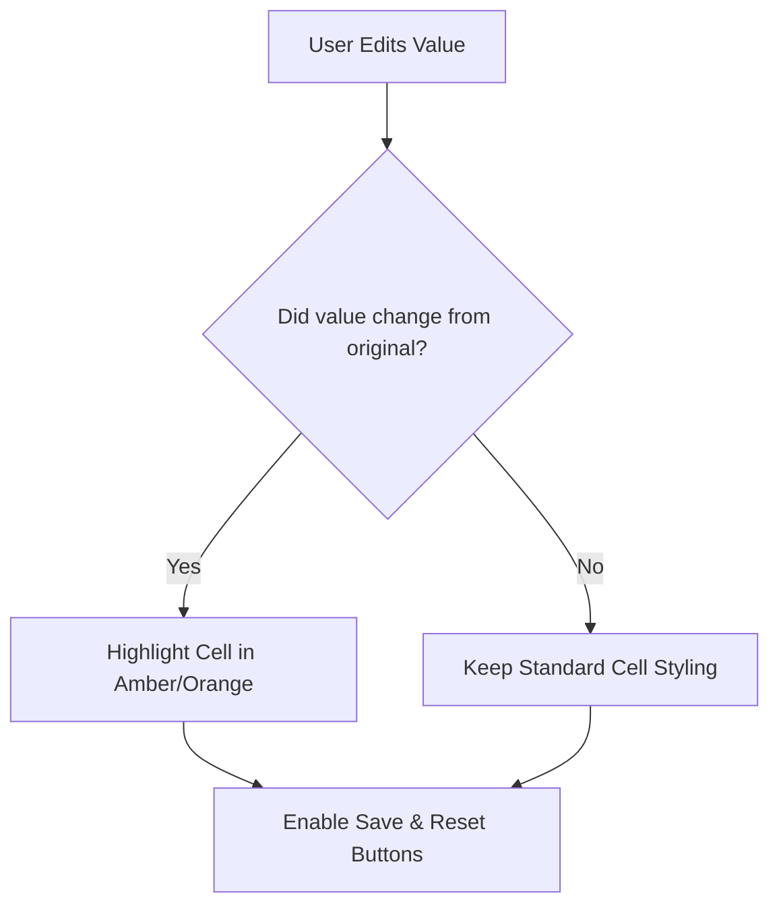

# CSO Scheduling System — App Creation Skills & Blueprint Guide

This blueprint consolidates the architectural paradigms, implementation guidelines, and developer lessons learned from building, optimizing, and correcting the CSO Scheduling System. It is designed to serve as a reusable, gold-standard playbook for engineering future enterprise-grade web applications.

---

## 🎨 1. Premium App Layout & Aesthetic Design System

Modern enterprise systems should look premium, visual, and clean. This layout system prioritizes **glassmorphism**, structured layouts, and uncluttered widgets.

### 📐 Structural Layout Guidelines
* **Responsive Layouts**: Use Tailwind CSS grids (`grid-cols-1 md:grid-cols-3`) or flexbox containers. Avoid rigid, hardcoded pixel dimensions for layouts.
* **Sticky Navigation**: Implement a sticky sidebar or top header (`sticky top-0 z-50`) to keep navigation and critical state indicators (like logged-in users, run status, or active filters) always accessible.
* **Visual Hierarchy**: 
  - Use **HSL-tailored colors** (like Slate and Indigo) for a high-end SaaS feel. Avoid saturated primary reds/blues.
  - Utilize **Lucide Icons** consistently inside colored badges (e.g. `p-1.5 bg-blue-50 text-blue-600 rounded-lg`).
  - Introduce **Subtle Animations** on loading indicators, alert indicators, or hover transitions (`transition-all duration-200 hover:shadow-md hover:scale-[1.01]`).

### 📦 Smart Collapsible Sections (Tidy Dashboards)
To display high-density analytical dashboards (such as audit trails or comparison tables) without cluttering the screen, use collapsible wrappers.

#### 💡 Collapsible Section Implementation:
```javascript
// 1. Declare state
const [isOpen, setIsOpen] = useState(false);

// 2. JSX Structure (No outer padding, uses overflow-hidden)
<div className="bg-white rounded-xl shadow-sm border border-gray-200 mb-8 overflow-hidden transition-all hover:shadow-md">
  {/* Header Button: Clickable, triggers toggle */}
  <div 
    onClick={() => setIsOpen(!isOpen)}
    className="flex items-center justify-between p-5 cursor-pointer select-none hover:bg-gray-50/40 transition-colors gap-4"
  >
    <div className="flex items-center space-x-2">
      <Bot className="w-5 h-5 text-indigo-600" />
      <h2 className="text-lg font-bold text-gray-800">Section Title</h2>
    </div>
    {isOpen ? <ChevronUp className="w-5 h-5 text-gray-500" /> : <ChevronDown className="w-5 h-5 text-gray-500" />}
  </div>

  {/* Content: Conditionally rendered, padded, border-t divider */}
  {isOpen && (
    <div className="p-5 border-t border-gray-100 bg-white">
      {/* Cards, Grids, or Tables go here */}
    </div>
  )}
</div>
```

---

## 📊 2. High-Performance Table Editing & Inline Changes

For high-density, interactive operational tables (e.g. rosters, staffing matrices, or schedule updates), **TanStack Table (`@tanstack/react-table`)** is the absolute industry gold standard.

### ⚠️ Critical TanStack Table Lessons
1. **Initialize All State Hooks**: Always declare state hooks for every binding you pass into the table. Forgetting to initialize a state variable (e.g. `columnSizing`) will cause the table renderer to raise silent `ReferenceError` crashes at runtime.
   ```javascript
   const [sorting, setSorting] = useState([]);
   const [rowSelection, setRowSelection] = useState({});
   const [columnSizing, setColumnSizing] = useState({}); // <-- MANDATORY
   ```
2. **Memoize Columns and Rows**: Always wrap columns and data in `useMemo` hooks to prevent unnecessary table re-renders when local states change.

### ✍️ Inline Cell Editing & Value Highlighting
When users modify table values, the app must provide instant visual feedback on edited elements and clear action controllers.



#### 💡 Highlighting Edited Cells Blueprint:
1. **Maintain Edited State**: Store an index or dictionary mapping coordinates (like `row_id` and `column_id`) to their modified values:
   ```javascript
   const [editedValues, setEditedValues] = useState({}); // e.g. { "row-123_required_handlers": 8 }
   ```
2. **Apply Conditional Classes**: Render edited inputs with visual highlights (such as amber borders or backgrounds) to indicate "dirty" unsaved fields:
   ```javascript
   const isEdited = editedValues[`${rowId}_${colId}`] !== undefined;
   
   return (
     <input
       type="number"
       value={isEdited ? editedValues[`${rowId}_${colId}`] : originalValue}
       onChange={(e) => handleEdit(rowId, colId, e.target.value)}
       className={`w-full text-center rounded px-2 py-1 border transition ${
         isEdited 
           ? 'bg-amber-50 border-amber-300 font-semibold text-amber-900' 
           : 'border-gray-200 bg-transparent'
       }`}
     />
   );
   ```
3. **Expose Action Banners**: Show a persistent action bar when changes are pending, containing **"Save Changes"** (calls backend database update API) and **"Reset"** (clears `editedValues` state) buttons.

---

## 🔑 3. Stateless Authentication (FastAPI JWT + Axios Interceptors)

A premium web app needs secure, smooth, and stateless user authentication. Attaching custom HTTP interceptors ensures that expired sessions are caught and handled automatically.

```
+------------+       HTTP Request + JWT        +-------------+
|            | ------------------------------> |             |
|   React    |                                 |   FastAPI   |
|   Client   | <------------------------------ |   Backend   |
|            |       401 Unauthorized Error    +-------------+
+------------+
      |
      v
Auto-Redirect to /login
```

### 🔒 Backend (FastAPI + OAuth2 Bearer Tokens)
* Use `python-jose` for JWT encoding/decoding and `passlib` (with `bcrypt`) for passwords.
* Require JWT on protected endpoints via dependencies:
  ```python
  from fastapi.security import OAuth2PasswordBearer
  oauth2_scheme = OAuth2PasswordBearer(tokenUrl="api/v1/auth/login")
  
  async def get_current_user(token: str = Depends(oauth2_scheme)) -> User:
      try:
          payload = jwt.decode(token, SECRET_KEY, algorithms=[ALGORITHM])
          # validate and return user
      except JWTError:
          raise HTTPException(status_code=401, detail="Could not validate credentials")
  ```

### 🛰️ Frontend Session Management (Axios Interceptors)
To prevent manual credential attaching and handle token expirations gracefully:
1. **Attach JWT Token**: Create an Axios instance that fetches the token from `localStorage` and appends it to the `Authorization` header of every request:
   ```javascript
   import axios from 'axios';
   
   const api = axios.create({
     baseURL: '/api/v1',
   });
   
   api.interceptors.request.use((config) => {
     const token = localStorage.getItem('token');
     if (token) {
       config.headers.Authorization = `Bearer ${token}`;
     }
     return config;
   }, (error) => Promise.reject(error));
   ```
2. **Handle 401 Session Timeouts**: Intercept incoming responses; if the backend returns an HTTP `401 Unauthorized` status code, automatically purge the token and redirect the client to the `/login` route:
   ```javascript
   api.interceptors.response.use(
     (response) => response,
     (error) => {
       if (error.response && error.response.status === 401) {
         localStorage.removeItem('token');
         window.location.href = '/login'; // Auto-redirect
       }
       return Promise.reject(error);
     }
   );
   ```

---

## 💾 4. Local Transactional Storage vs. Analytics Warehouses

Choosing the right database engine is crucial for interactive performance. 

| Feature | SQLite (Local File) | BigQuery (Streaming Warehouse) |
| :--- | :--- | :--- |
| **Workload Type** | **Transactional (OLTP)** — Immediate CRUD | **Analytical (OLAP)** — High-volume aggregation |
| **Read-after-Write**| **Instant** — Updates are visible immediately | **Delayed (Up to 90 min)** due to streaming buffers |
| **Latency** | **< 1ms** (local read/write) | **Hundreds of ms** to seconds (network roundtrip) |
| **GCP Setup** | **Zero** — Embedded local file | **Complex** — Datasets, tables, service roles |

### 💡 The Golden Rule:
* **SQLite** (or PostgreSQL/Cloud SQL) should be used for all **transactional operational databases** (where the user needs to upload data, run processes, edit cells, or view immediate results). SQLite is incredibly fast, simple, and has zero latency.
* **BigQuery** should only be used as a downstream **analytical warehouse** (where data is periodically synced for executive reporting, BI dashboards, or machine learning pipelines). **Never** call BigQuery directly from a real-time web application endpoint that requires immediate transactional feedback.

---

## 🤖 5. Smart File Ingestion with Gemini Auditing

Instead of building rigid, fragile CSV parsers that break whenever columns shift, leverage **Gemini 3.5 Flash** to analyze, audit, and normalize file structures in real-time.

```
User File (Excel/CSV) 
      |
      v
Backend Endpoint 
      |
      v
Send Schema & Raw Header to Gemini 3.5 Flash 
      |
      v
Gemini Validates Schema & Columns 
      |
      +---> [Valid]   --> Insert into Database (SQLite)
      |
      +---> [Invalid] --> Return intelligent formatting errors to User
```

### 💡 Gemini File-Audit Implementation Pattern:
1. **Ingest Raw File Headers**: Parse only the top rows of the uploaded file (retains tokens and speeds up requests).
2. **Supply Context to Gemini**: Send the parsed structure to Gemini via the `google-genai` SDK along with your database model requirements.
3. **Generate Actionable Feedback**: Instruct Gemini to output structured JSON indicating validity and exact column mapping:
   ```json
   {
     "is_valid": false,
     "error_reason": "Missing required 'Employee Name' column.",
     "suggested_fix": "Please rename column 'Name' in your Excel file to 'Employee Name' or verify the sheet layout."
   }
   ```
4. **Display to User**: Show Gemini's feedback in a gorgeous, sliding sidebar or alerts tray, blocking insertion if `is_valid` is `false`.

---

## 🚀 6. Production Deployment (Containerization & Cloud Run)

To deploy a combined React and Python application effortlessly, use a **multi-stage Docker build** deployed to **Google Cloud Run**.

### 🐳 Multi-Stage Dockerfile (Gold Standard)
This Dockerfile compiles Vite static assets, bundles them into a Python server, and deploys a single high-performance container.

```dockerfile
# Stage 1: Build Frontend Assets
FROM node:20-slim AS frontend-builder
WORKDIR /app/frontend
COPY frontend/package*.json ./
RUN npm ci
COPY frontend/ ./
RUN npm run build

# Stage 2: Serve Python API + React Static Assets
FROM python:3.11-slim
WORKDIR /app

# Install backend python dependencies
COPY backend/requirements.txt ./
RUN pip install --no-cache-dir -r requirements.txt

# Copy backend source code
COPY backend/ ./backend/

# Copy React build from Stage 1 into backend's static directory
COPY --from=frontend-builder /app/frontend/dist ./frontend/dist/

# Set env and expose Cloud Run PORT
ENV PORT=8000
EXPOSE $PORT

# Start application server (FastAPI serves static assets via mount)
CMD ["sh", "-c", "cd backend && uvicorn app.main:app --host 0.0.0.0 --port $PORT"]
```

### ☁️ Google Cloud Run CLI Deploy Command
Execute this command from the project root to build and deploy to Google Cloud Run:
```bash
gcloud run deploy cso-scheduling \
  --source . \
  --region us-central1 \
  --allow-unauthenticated \
  --set-env-vars "GCP_PROJECT_ID=my-project-0004-346516,VERTEX_AI_LOCATION=us-central1,SECRET_KEY=production-secret-$(openssl rand -hex 32)" \
  --memory 2Gi \
  --cpu 2 \
  --timeout 600 \
  --project my-project-0004-346516 \
  --quiet
```

---

# 📱 Mobile Web App & Wearable Integration Guide

This section consolidates the layout tokens, geocoding telemetry configurations, and token-based wearable synchronizations engineered for the mobile-responsive lineage-health portal.

## 🎨 Layout & Aesthetic Assets
* **Glassmorphic Theme**: HSL color tokens, backdrop filters, and custom slide drawers.
* **SVG Concentric Rings**: Native-feeling dynamic circular indicators for calorie and workout metrics.

## 🗺️ Geocoding & Timezones
* **OSM Nominatim API**: Resolves and reverse-geocodes browser coordinate arrays with active error boundary fallbacks.
* **Translating Agenda Calendars**: Client-side timezone conversions aligning appointments and dates on-the-fly.

## ⚡ Garmin Connect Sync
* **Stateless API Gateway**: Exchanging bearer tokens and caching active cookies inside secure writable directories (`/tmp`) to avoid rate limit barriers.
* **Logs Streams Console**: Green, red, cyan progress lines updating the UI of connection and dataset synchronizations.

## Contents
* [mobile_app_skills.md](mobile_app_skills.md) - Complete Mobile Layout & Hardware Integration Manual.

