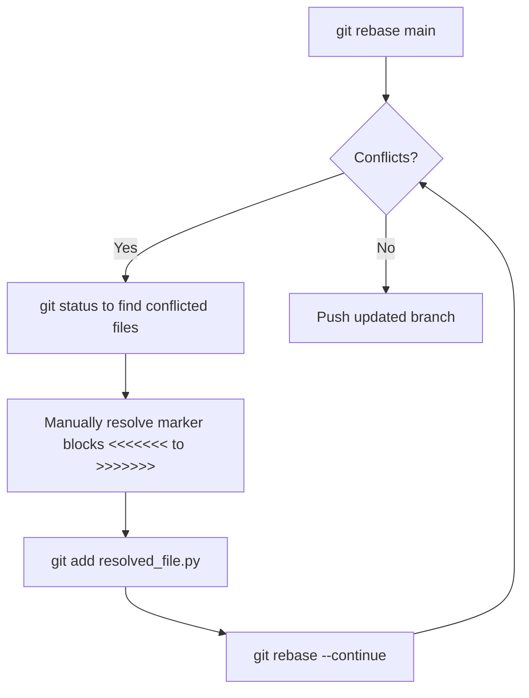

# 🐙 GitHub and Git Automation Skill

Use this skill when you need to automate version control workflows, collaborate on branch structures, or programmatically interface with GitHub using the CLI or REST APIs.

---

## 1. Branch Management & Git Hygiene

Always keep your local branches synchronized and clean.

### 📐 Branch Naming Convention
*   **Features:** `feat/short-description`
*   **Fixes:** `fix/bug-description`
*   **Documentation:** `docs/update-description`
*   **Refactoring:** `refactor/clean-up-description`

### 🚀 Creating and Syncing a Feature Branch
```bash
# Ensure you are on the default branch and fully updated
git checkout main
git pull origin main

# Create and switch to your feature branch
git checkout -b feat/add-oauth-provider
```

---

## 2. Conventional Commits Standard

Write clear, structured commit messages to generate clean change logs automatically.

Format: `<type>(<scope>): <short summary>`

### 🎨 Examples
*   `feat(auth): integrate google oauth login provider`
*   `fix(db): resolve postgreSQL connection pool leak under heavy load`
*   `docs(readme): document the local setup and docker running instructions`
*   `refactor(api): modularize routes into controller files`

---

## 3. GitHub CLI (`gh`) Programmatic Workflows

The GitHub CLI (`gh`) is the preferred method for programmatically interacting with pull requests and repositories.

### 🔑 Authentication Status Check
Ensure the CLI is authenticated before running operations:
```bash
gh auth status
```

### 🔀 Creating a Pull Request
To programmatically create and submit a pull request:
```bash
gh pr create \
  --title "feat(auth): integrate google oauth login provider" \
  --body "This PR adds the Google OAuth login provider to the FastAPI backend, implements local JWT sessions, and registers redirects." \
  --base main \
  --head feat/add-oauth-provider \
  --reviewer team-lead-username
```

### 🔍 Checking PR Status & Approvals
```bash
# View details of the active PR for the current branch
gh pr status

# List recent PRs
gh pr list --limit 10
```

---

## 4. Conflict Resolution Workflows

When merging or rebasing encounters conflicts, follow this clean resolution flow:



### 💡 Conflict Resolution Protocol:
1.  **Identify Conflicts:** Find conflicted files with `git status`.
2.  **Edit Markers:** Search for conflict markers:
    ```python
    <<<<<<< HEAD
    # Local code changes
    =======
    # Incoming code changes
    >>>>>>> main
    ```
3.  **Resolve:** Edit the code to cleanly merge both intentions, then remove the markers completely.
4.  **Continue:** Run `git add <resolved-file>` and then `git rebase --continue` (or `git merge --continue`). Do not commit manually during a rebase.
